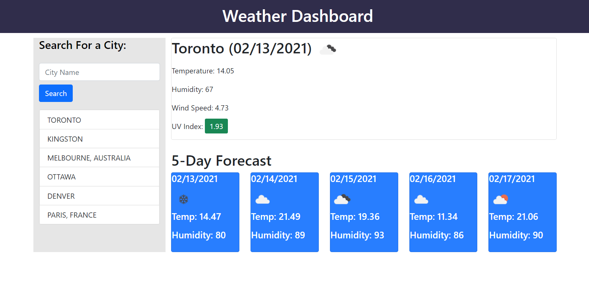
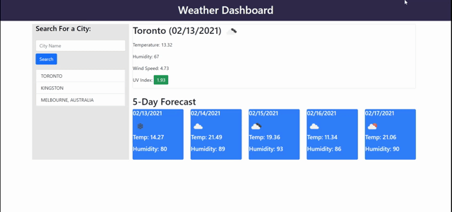

# Weather Dashboard

## Description
A dashboard that allows the user to search a city and returns the weather forecast.

Table of Contents |
-------------------|
[Usage](#Usage)
[Technologies](#Technologies)
[Screenshots](#Screenshots)
[Contributing](#Contributing)
[Author](#Author)
[Questions](#Questions)

 

## Usage

The website displays the weather based on the user's input. The user can enter a city in the left-hand search, which appends to the search history. The weather for the city is then displayed on the right, with the temperature, humidity, wind speed and UV Index for the day at the top and a 5-day forecast below.

Depending on the UV Index, the background color will change. The search history function allows for a user to click on a previously searched city and the dashboard will load the weather for that city.

You can find the deployed link and the repository link below:

Deployed Link: [Deployed Link](https://cerafinn.github.io/weather-dashboard)

Repo Link: [Repo Link](https://github.com/cerafinn/weather-dashboard)

 

## Technologies

* HTML
* CSS
* JavaScript
* OpenWeather API
* jQuery
* BootStrap
* Moment
* Local Storage

 

## Screenshots

## Contributing

If interested in contributing to the project, feel free to reach out. Contact information can be found in the Questions section.

 

## Author

Andaleeb Farooq: [:octocat:](https://github.com/cerafinn)

 

## Questions

If you have any questions or issues, feel free to reach out at: andaleeb.farooq@gmail.com.
You can also find more of my work on Github at [github link](https://github.com/cerafinn).